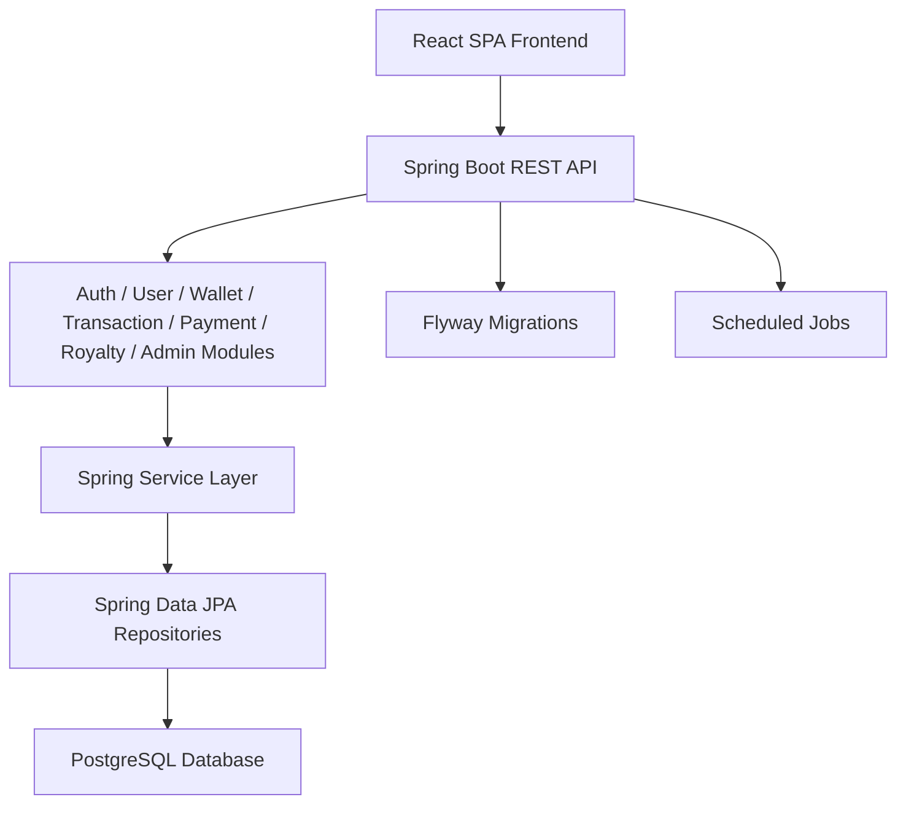

# Analysis Answers

## 1. Are we using in-memory data in the application?

No. The application is not using an in-memory database or in-memory storage for the core business data.

What the code shows:
- The backend is configured to use PostgreSQL via Spring Data JPA.
- The datasource is defined in backend/src/main/resources/application.yml.
- The schema is created and seeded through Flyway SQL migrations in backend/src/main/resources/db/migration/.
- The entities and repositories persist users, wallet balances, reversal wallet data, ledger entries, transactions, pincode data, and royalty configuration to the database.

So the application is using persistent relational storage, not in-memory data.

## 2. What architecture are we implementing?

Based on the actual codebase, the application is implementing a layered modular monolith architecture.

### Why this is the correct architecture

1. Frontend layer
- A React + TypeScript SPA runs in the browser.
- It uses React Router for navigation and communicates with the backend through REST APIs.

2. API layer
- A Spring Boot backend exposes REST endpoints under /api/.
- The API layer is organized by business modules such as auth, user, wallet, transaction, payment, royalty, and admin.

3. Service layer
- Business logic is implemented in service classes such as AuthService, UserService, WalletService, TransactionService, CheckoutService, and AdminService.
- These services coordinate domain behavior, validation, and persistence.

4. Persistence layer
- Spring Data JPA repositories save and retrieve domain data from PostgreSQL.
- This is a single backend service with one database, which is the definition of a modular monolith rather than a distributed microservice architecture.
<!--  -->

5. Supporting infrastructure
- Security is configured centrally.
- Exception handling is centralized.
- Flyway migrations manage schema evolution.
- Scheduled jobs are supported through Spring scheduling.

### Architecture diagram

## 3. Additional implementation observations

### Backend
- Built with Java, Spring Boot, Spring Security, Spring Data JPA, Flyway, and PostgreSQL.
- Organized as a modular monolith with domain-based packages.
- Implements wallet, onboarding, checkout, auth, and admin flows.
- Uses PostgreSQL persistence rather than mock or in-memory storage.

### Frontend
- Built with React, TypeScript, Vite, and React Router.
- Uses localStorage for simple client-side session persistence.
- Calls the backend REST endpoints for auth, onboarding, wallet summary, and checkout preview.

## 4. Summary

The application is not using in-memory data. It is implementing a layered modular monolith architecture with a React frontend, a Spring Boot backend, and a PostgreSQL-backed persistence layer.
